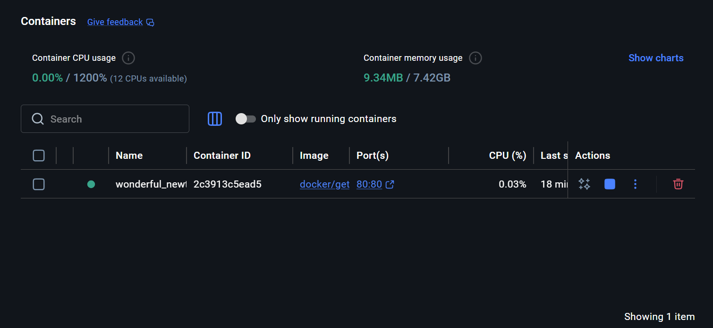
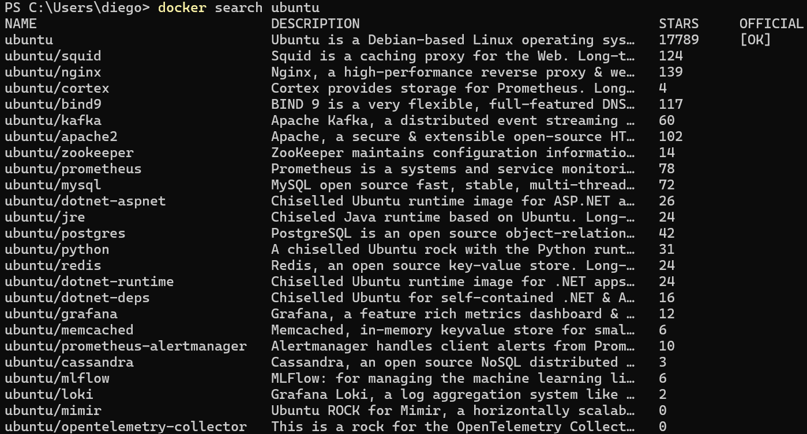
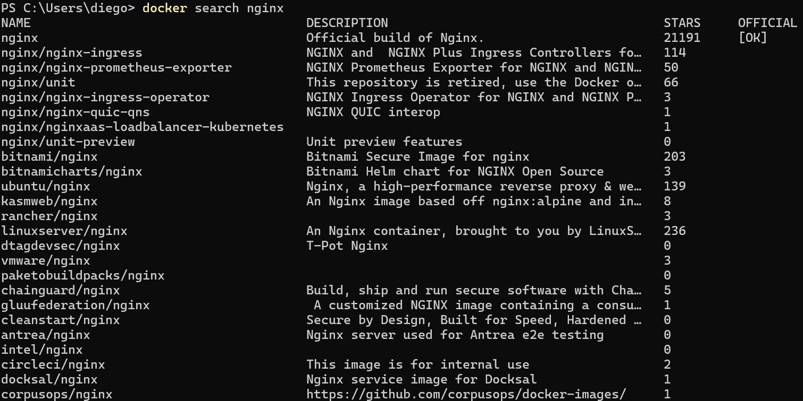
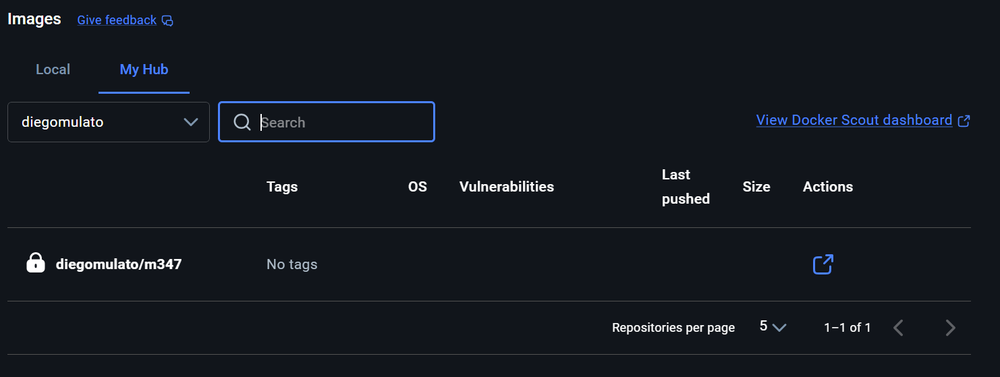
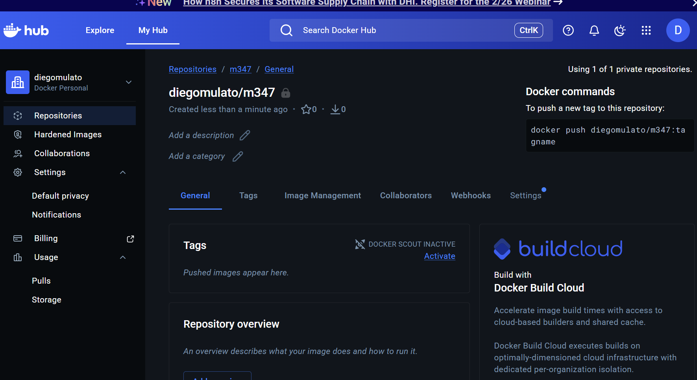
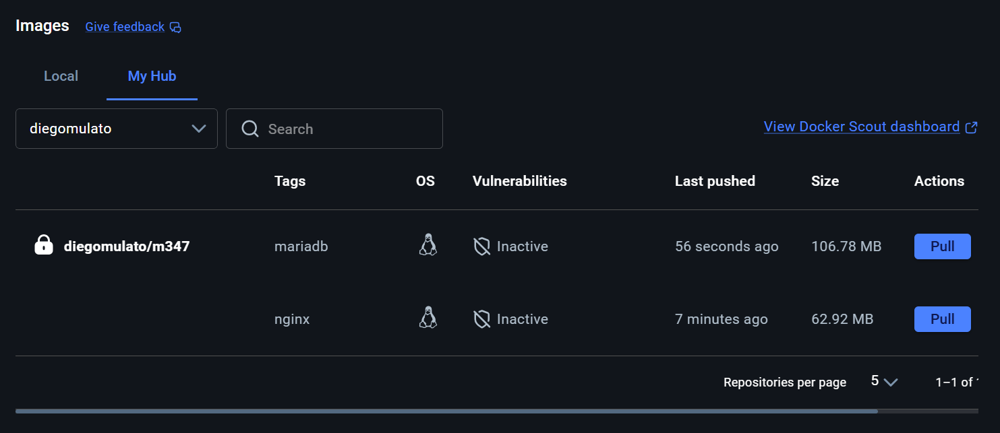

# KN01

## Installation




## Docker Command Line Interface (CLI) 

### Docker Version herausfinden
Die Version von Docker finde ich mit `docker version` herausfinden.

### Ubuntu und Nginx search



# Befehl erklären

```bash
docker run -d -p 80:80 docker/getting-started
```

`docker`

Das Docker-CLI-Programm.
Damit werden Docker-Befehle ausgeführt.

`run`

Startet einen neuen Container aus einem Image.
Falls das Image noch nicht lokal vorhanden ist, wird es automatisch heruntergeladen.

`-d`

Steht für detached mode.
Der Container läuft im Hintergrund weiter und blockiert das Terminal nicht.
Ohne -d würde das Terminal die Container-Ausgabe anzeigen und belegt bleiben.

`-p 80:80`

Port-Mapping (Port-Weiterleitung).

Aufbau:

`-p <Host-Port>:<Container-Port>`

Bedeutung hier:

Linke 80 -> Port auf dem Host (Computer)

Rechte 80 -> Port im Container

Wenn im Browser http://localhost:80 aufgerufen wird, wird der Traffic an Port 80 im Container weitergeleitet.

`docker/getting-started`

Name des Images auf Docker Hub.

`docker` = Repository / Organisation

`getting-started` = Image-Name

Docker lädt dieses Image und erstellt daraus einen Container.

### Nginx Image


### Ubuntu Image

`docker run -d`

Das Image wird automatisch heruntergeladen und gestartet, aber es schaltet direkt wieder ab. Es hat kein aktiven Hauptprozess-Command (z.B. ein Webserver). Fazit: Container startet kurz und beendet direkt wieder, weil nichts läuft, dass ihn am Leben hält.

`docker run -it ubuntu`

Durch `-it` wird der Container interaktiv mit einem Terminal gestartet. Im Gegensatz zu `-d` läuft der Container weiter, weil die Shell selbst der aktive Prozess ist. Sobald man `exit` eingibt, beendet sich die Shell und auch der Container

### Interaktive Shell nginx Container


### Liste der Befehle die ich benutzt habe
[Liste der Befehle](befehlekn01.md)

## Registry und Repository




## Privates Repository

```bash
docker tag nginx:latest diegomulato/m347:nginx
```

Mit `docker tag` wird kein neues Image erstellt, sondern nur ein zusätzlicher Name (Alias) für ein bestehendes Image vergeben.

`nginx:latest` -> bestehendes lokales image
`diegomulato/m347:nginx` -> neuer Name für dasselbe Image

Ein Tag ist eine Versionsbezeichnung eines Images. Der Tag unterscheidet verschiedene Versionen, hilft beim Versionieren und ist nur ein Label, kein neues Image.

--- 

```bash
docker push diegomulato/m347:nginx
```

Mit `docker push` wird ein lokales Image in eine Remote-Repository hochgeladen z.B. auf Docker Hub. 

`diegomulato` -> Docker Hub Benutzername
`m347` -> Name des Repositories
`nginx` -> Tag



**MariaDB Image hinzufügen:**
 
1. **Image herunterladen:**
   ```sh
   docker pull mariadb
   ```
 
2. **Image taggen:**
   ```sh
   docker tag mariadb:latest diegomulato/m347:mariadb
   ```
 
3. **Image pushen:**
   ```sh
   docker push diegomulato/m347:mariadb
   ```