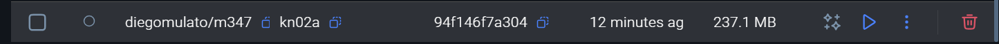
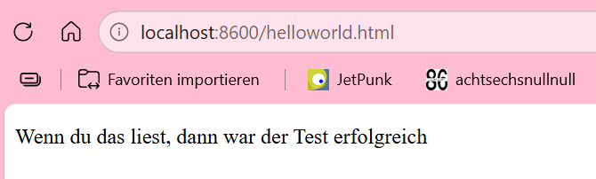

# KN02

## Dockerfile I
### Dokumentiertes Dockerfile
[Dokumentiertes Dockerfile](a/Dockerfile)

### Notwendige Docker-Befehle für Build/Push

```bash
docker build  -t diegomulato/m347:kn02a .
```

```bash
docker push diegomulato/m347:kn02a
```

```bash
docker run -d -p 8600:80 diegomulato/m347:kn02a
```





## Dockerfile II

### Datenbank (MariaDB)
[Dockerfile](./b/db/Dockerfile)

Docker build befehl
```bash
docker build -t diegomulato/m347:kn02b-db .
```
Docker run befehl
```bash
docker run -d --name kn02b-db -p 3306:3306 diegomulato/347:kn02b-db
```
`--name kn02b-db`: Gibt dem Container eindeutigen Namen, damit der Web-Container ihn über `--link` ansprechen kann
`-p 3306:3306`: Expeniert MariaDB-Port auf dem Host (für Telnet-Test)

Telnet-Test(DB erreichbar):
```bash
telnet localhost 3306
```

Docker push Befehl
```bash
docker push diegomulato/m347:kn02b-db
```

### Website (PHP/Apache)
[Dockerfile](./b/web/Dockerfile)

`db.php` verbindet sich mit Datenbank über Containernamen `kn02b-db` als Hostname, funktioniert durch `--link`
[db.php](./b/web/db.php)

Docker build Befehl:
```bash
docker build -t diegomulato/m347:kn02b-web .
```

Docker run befehl:
```sh
docker run -d --name kn02b-web -p 8080:80 --link kn02b-db:kn02b-db diegomulato/m347:kn02b-web
```
`--link kn02b-db:kn02b-db`: Verlinkt den laufenden DB-Container. Das Format ist `--link <Containername>:<Alias>`. Der Alias `kn02b-db` ist die Domain, die in `db.php` als `$servername` verwendet wird.  
`-p 8080:80`: Webseite ist unter http://localhost:8080 erreichbar.

Docker push Befehl
```bash
docker push diegomulato/m347:kn02b-web
```

### Screenshots
[php seite](../img/infophpproof.png)

[db seite](../img/dbphpproof.png)

[telnet](../img/telnetproof.png)